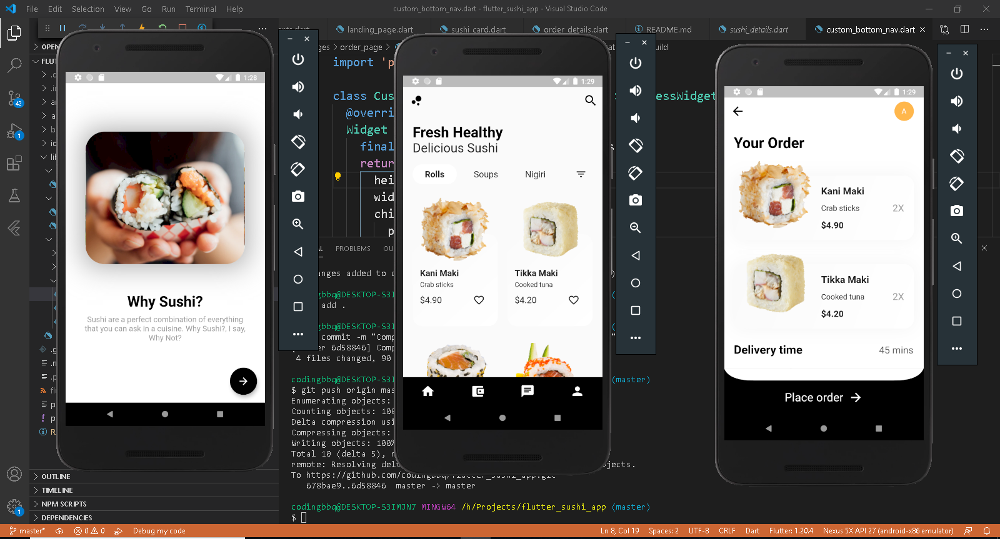

# Flutter Sushi App

Flutter UI challenge 007 - Sushi App : I take upon this UI challenge to learn and get a better understanding of how flutter works.

[Github](https://github.com/codingbbq/flutter_sushi_app)

[Design](https://dribbble.com/shots/14238521-Sushi-Mobile-App-UX-UI-Design/attachments/5883021?mode=media)

[Youtube @codingbbq](https://www.youtube.com/channel/UCcxqwN9AGUNd3C9bNmvVlhw)

---

## Live stream logs

-[11 Oct 2020 - Live Stream](https://youtu.be/r6o58SVa2Y0) 
In this live stream, we setup the flutter project and start working our way through the starter/landing page. 

-[12th Oct 2020 - Live Stream](https://youtu.be/HsCeFsbFijk)

-[13th Oct 2020 - Live Stream](https://youtu.be/F_n-4oRzmyc)

-[14th Oct 2020 - Live Stream](https://youtu.be/kufFa9U7Z98)

-[15th Oct 2020 - Live Stream](https://youtu.be/HV6-ggfMnXY)

-[16th Oct 2020 - Live Stream](https://youtu.be/YTfOhsTD6mg)
In this stream, we try to accomodate the gridView with the images on top. The height of each gridCell is fixed which causes a problem for expanding content. I need to figure out how expanding gridTile/gridCells work.

-[17th Oct 2020 - Live Stream 1](https://youtu.be/scUTjKF5PPU)
-[17th Oct 2020 - Live Stream 2](https://youtu.be/pGsg6e_tYJ8)
-[17th Oct 2020 - Live Stream 3](https://youtu.be/SuqbOFojyJw)

On 17th October 2020, I wanted to get the maximum of the weekend, so ended up doing 3 streams back to back in the entire day. Most of my time was spend figuring out how the customPaint widget worked and how to get the desired custom button for the order page.

-[18th Oct 2020 - Live Stream](https://youtu.be/vAj66rFD9jE)
In this live stream, we conclude the entire UI challenge. 

# What went well
- I was able to spend some time in understanding the CustomPaint widget. 
- Because of the live streams, the app UI came really good and it is almost 80% similar to what the design is. So I am happy about it.
- All in all, to make the three pages, it took me around 10 live streams of an average 30 minutes. Which means that a total of 5hrs spread across a week.

# What did not go well
- There is still scope of improvement and getting the UI as close to the design
- Some of the areas such as card, list has a defined width and height which means that there is limited scope of having expanding content. I need to learn to code so that the UI is adaptive.

Below are screenshot of the final UI

